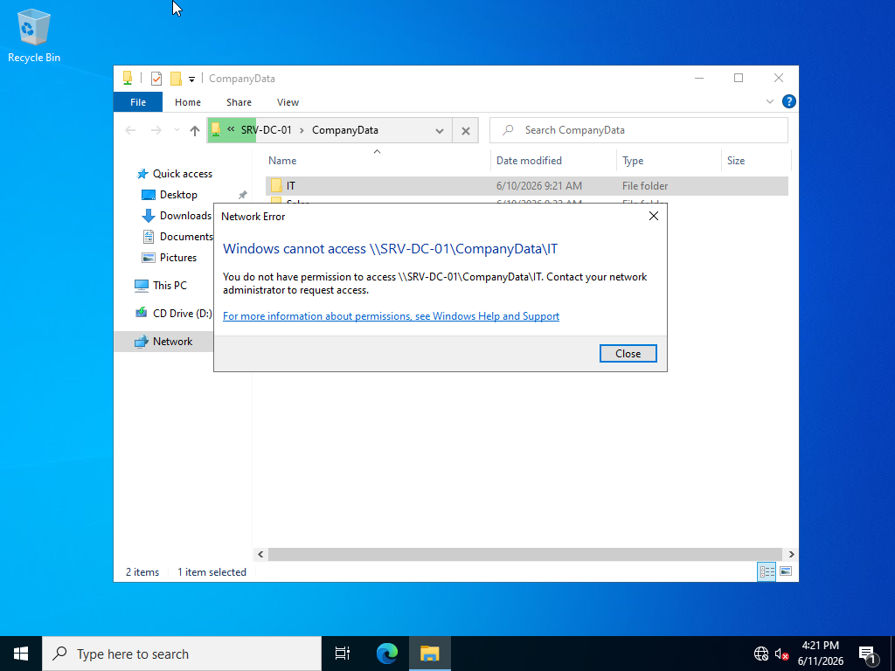
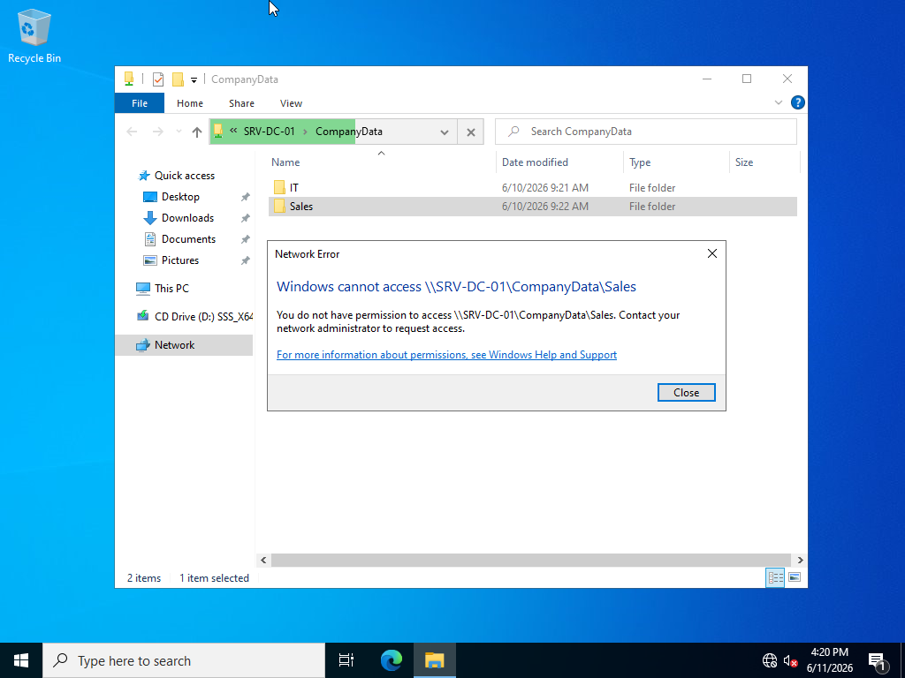
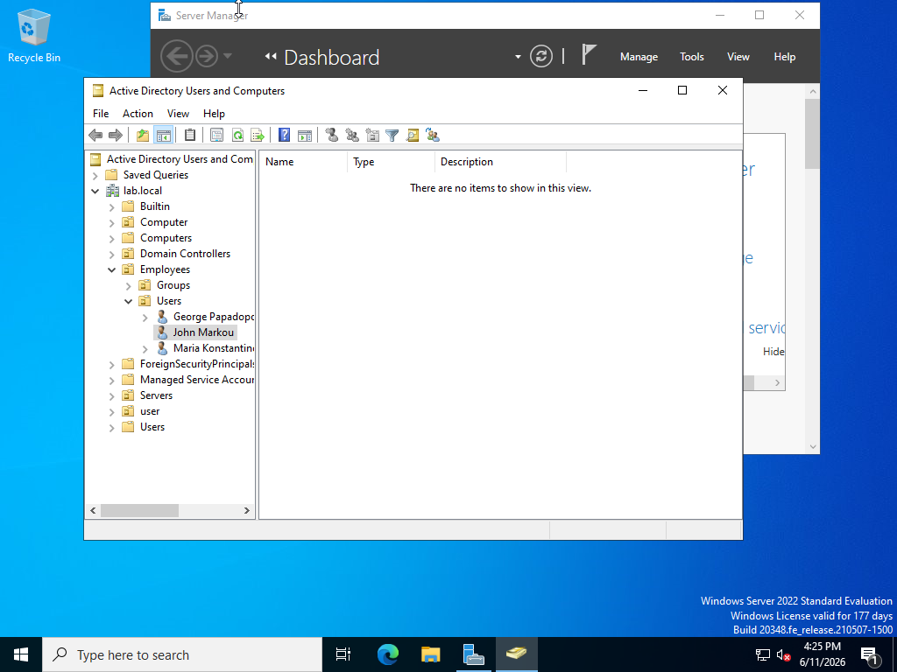
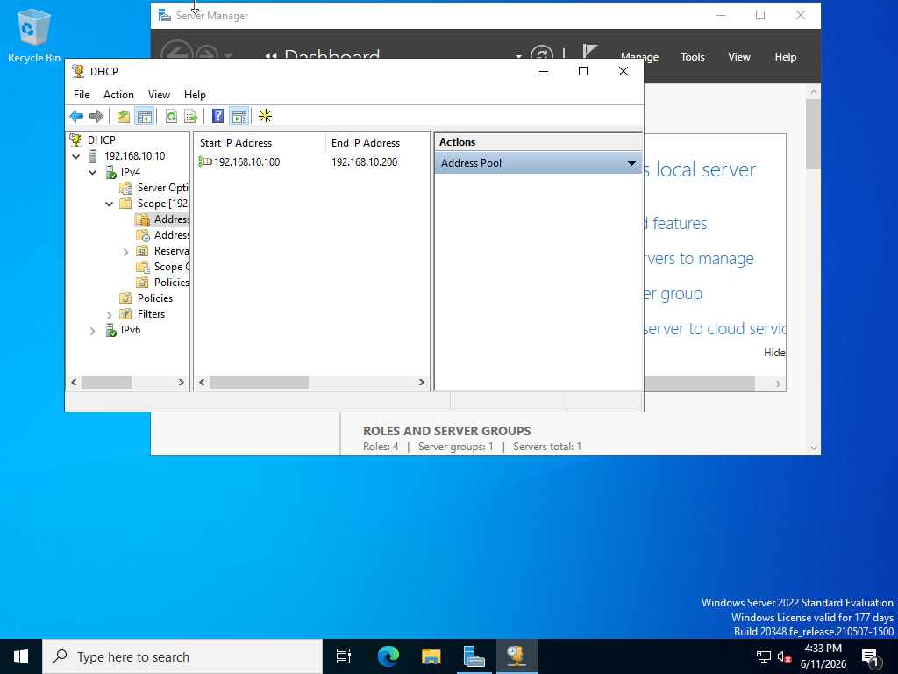
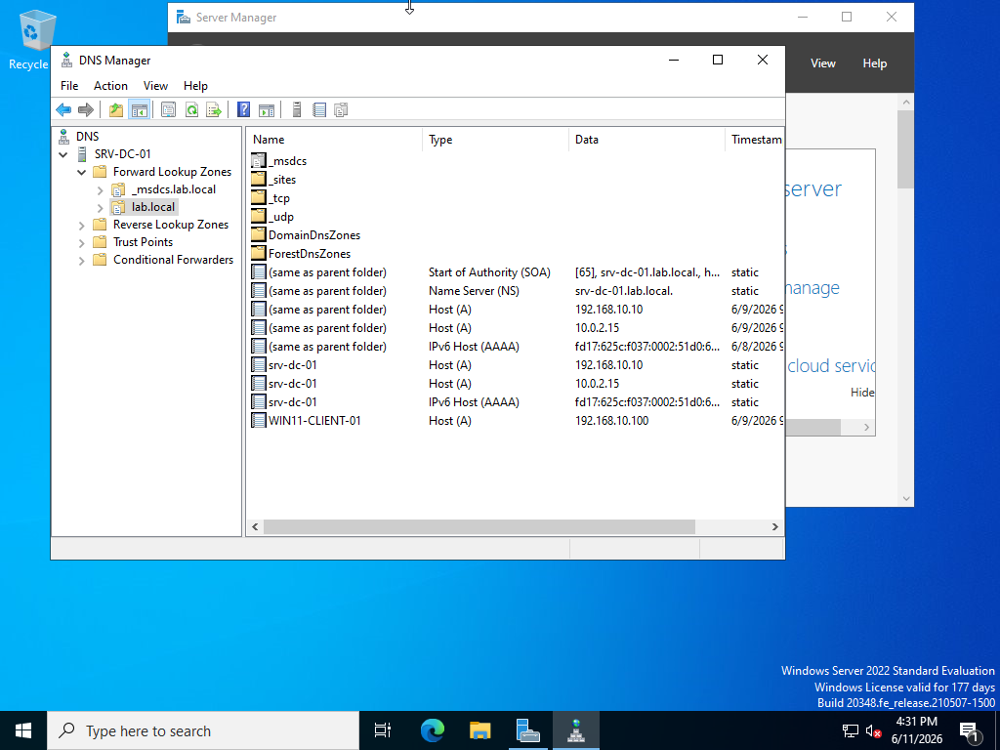
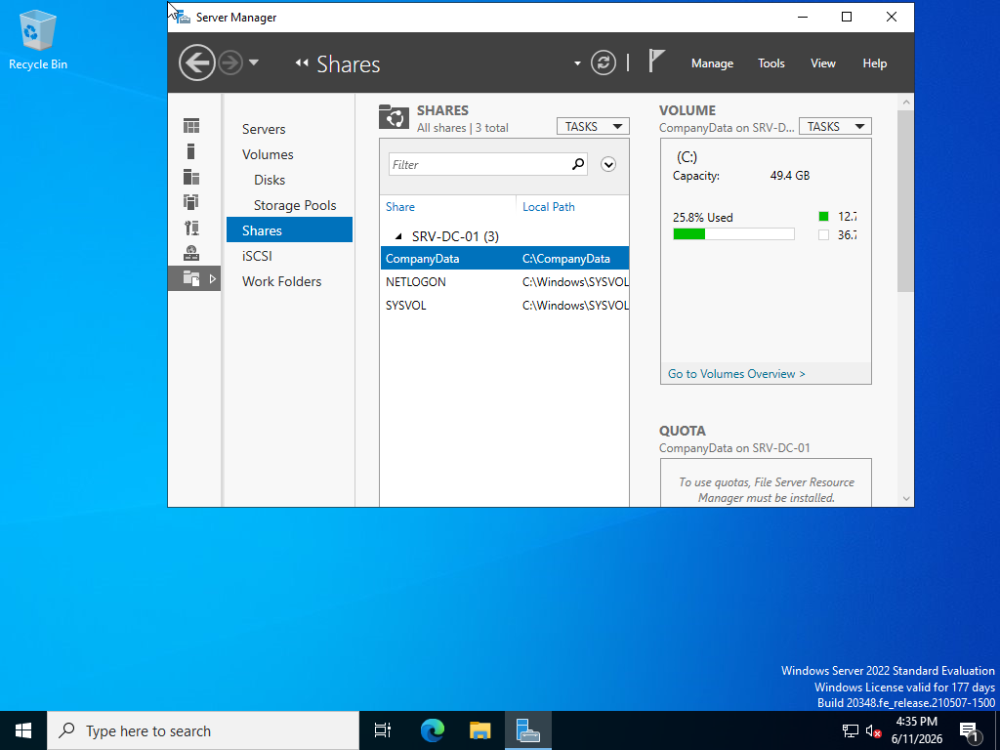
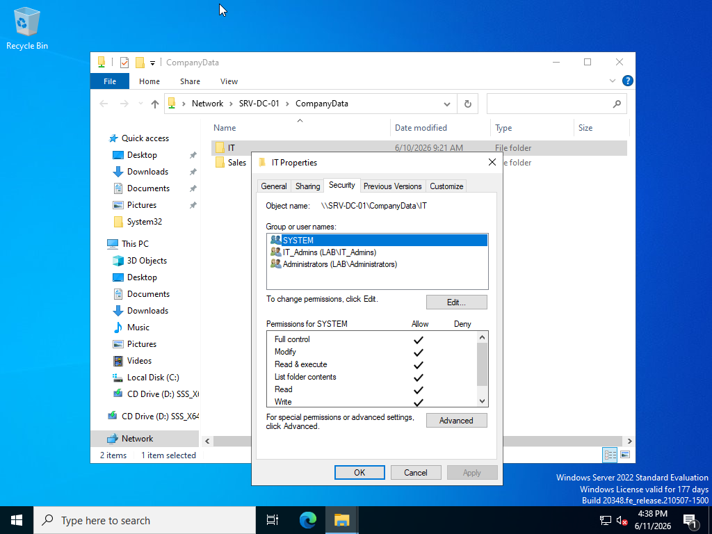
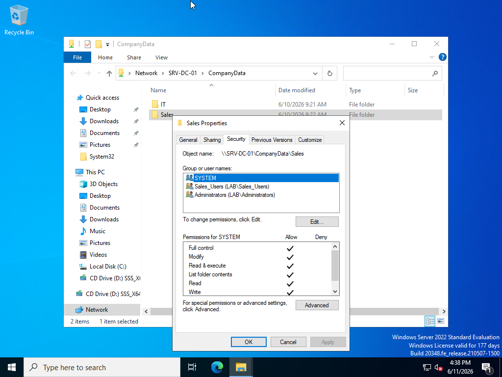

# Active Directory Home Lab  

## Overview   

## Lab Architecture

Windows Server 2022
|
|
lab.local Domain
|

| |
WIN11 Client File Server  

A Windows Server 2022 Active Directory lab environment with centralized authentication,  
DHCP, DNS, file services, NTFS permissions and Group Policy management.

This project demonstrates a small enterprise-style Windows infrastructure with user management,  
access control and policy-based configuration  

---  
## Environment

- Windows Server 2022  
- Windows 11 Client  
- Active Directory Domain Services  
- Domain: lab.local  

---  
## Network Configuration  

Domain Controller:  

SRV-DC-01  
IP: 192.168.10.10  

Client:  
WIN11-CLIENT-01  
IP: 192.168.10.100  

Network:  
LABNET  
192.168.10.0/24  

---  
# Implemented Features

## Active Directory

Configured:

- Domain Controller
- Users
- Security Groups
- Organizational Units

## User Access Model

Security groups were used to manage access.

IT_Admins:
- georgepap

Sales_Users:
- mariakon

Domain Users:
- johnmarkou (test user) 

  

Screenshot:  

  

---

# DHCP Configuration  

Configured DHCP scope:    
Scope:  
192.168.10.0/24  

Range:  
192.168.10.100 - 192.168.10.200  

Client receives IP automatically from DHCP.  

Screenshots:  

  

  

---

# DNS Configuration    

Configured internal DNS records for:    
lab.local  
SRV-DC-01  
WIN11-CLIENT-01  

Screenshot:  

  

---  
## File Server Configuration

Configured SMB file sharing with department-based access control.

Share:

\\SRV-DC-01\CompanyData

Folders:
- IT
- Sales

  

---

## NTFS Permissions  

Permissions are managed through Active Directory Security Groups.  

IT folder:  
- IT_Admins group  

Sales folder:  
- Sales_Users group  

  

   

---

## Author
Georgios Konstantopoulos
